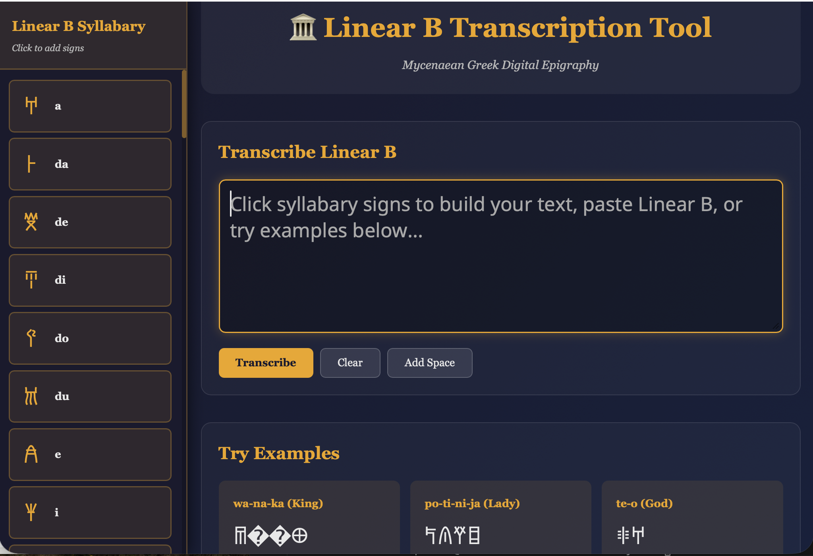

# 🏛️ Linear B Transcription & Analysis Tool

A web-based tool for transcribing and analyzing Linear B script - the earliest form of written Greek (c. 1450-1200 BCE). This project bridges computational linguistics, ancient epigraphy, and web development to make Mycenaean Greek accessible to researchers and enthusiasts.


## ✨ Features

- **Interactive Syllabary**: Click-to-build interface with all 59 Linear B syllabograms
- **Real-time Transcription**: Convert Linear B Unicode to Greek transliteration and phonetic transcription
- **Morphological Analysis**: Detailed linguistic breakdown of 27+ Mycenaean Greek words
- **Sound Change Tracking**: Visualize phonological evolution from Mycenaean to Classical Greek
- **Example Corpus**: Pre-loaded authentic Linear B words and phrases
- **Responsive Design**: Beautiful gradient interface inspired by Bronze Age aesthetics

## 🎯 Live Demo 


## 🚀 Quick Start

### Prerequisites
```bash
Python 3.10+
pip
```

### Installation

1. **Clone the repository**
```bash
git clone https://github.com/YOUR_USERNAME/linear-b-tool.git
cd linear-b-tool
```

2. **Create virtual environment**
```bash
python -m venv venv
source venv/bin/activate  # On Windows: venv\Scripts\activate
```

3. **Install dependencies**
```bash
pip install -r requirements.txt
```

4. **Run the application**
```bash
python backend/app.py
```

5. **Open your browser**
```
http://localhost:5000
```

## 📚 Project Structure
```
linear-b-tool/
├── backend/
│   ├── app.py              # Flask web server
│   ├── transcriber.py      # Core transcription engine
│   ├── analyzer.py         # Morphological analysis
│   └── data/
│       ├── syllabary.json  # 59 Linear B signs
│       └── lexicon.json    # 27 Mycenaean words
├── frontend/
│   ├── templates/
│   │   └── index.html      # Main web interface
│   └── static/
│       ├── css/style.css   # Styling
│       └── js/app.js       # Client-side logic
├── test_basic.py           # Test suite
└── README.md
```

## 🔬 Technical Details

### Transcription Engine

The transcription engine maps Linear B Unicode characters (U+10000 to U+1007F) to their phonetic values using a comprehensive syllabary database. The system handles:

- Syllable-by-syllable conversion
- Word boundary detection
- Phonetic vs. transliteration output
- Unknown sign handling

### Linguistic Analysis

Each word in the lexicon includes:
- Mycenaean reconstruction
- Classical Greek equivalent
- Grammatical information (part of speech, declension, case)
- Etymology and sound changes
- Semantic meaning

### Example Analysis

**Input**: 𐀷𐀙𐀏 (Linear B)

**Output**:
- Transliteration: `wa-na-ka`
- Reconstruction: `wanax`
- Classical Greek: `ἄναξ (anax)`
- Meaning: "king, lord"
- Sound Change: Loss of initial digamma (w → ∅)

## 🎓 About Linear B

Linear B is a syllabic script used by the Mycenaean Greeks between approximately 1450-1200 BCE. It was primarily used for administrative records on clay tablets found at sites including:

- Knossos (Crete)
- Pylos (Peloponnese)
- Mycenae (Peloponnese)
- Thebes (Boeotia)

The script remained undeciphered until 1952, when architect Michael Ventris and classicist John Chadwick demonstrated it represented an early form of Greek.

## 🛠️ Technologies Used

- **Backend**: Python 3, Flask
- **Frontend**: HTML5, CSS3 (Grid/Flexbox), Vanilla JavaScript
- **Data Format**: JSON
- **Fonts**: Google Fonts (Noto Sans Linear B)

## 📖 Usage Examples

### Transcribe a Word

1. Click syllabary signs in the left sidebar to build a word
2. Or paste Linear B Unicode directly: `𐀷𐀙𐀏`
3. Click "Transcribe" to see results
4. View transliteration, phonetic form, and linguistic analysis

### Explore Examples

Click any example card to load pre-configured Linear B words:
- **wa-na-ka** (ϝάναξ): king, lord
- **po-ti-ni-ja** (πότνια): mistress, goddess
- **te-o** (θεός): god

## 🤝 Contributing

This is an academic research tool. Contributions are welcome, especially:

- Additional vocabulary entries (with citations)
- Corrections to linguistic analysis
- UI/UX improvements
- Bug reports

## 📚 Data Sources

- Ventris, M. & Chadwick, J. (1956). *Documents in Mycenaean Greek*
- [Palaeolexicon](https://www.palaeolexicon.com/) - Mycenaean Greek Lexicon
- [DĀMOS Database](http://damos.chs.harvard.edu/) - Linear B Tablet Corpus
- Unicode Consortium - Linear B Unicode Block (U+10000–U+1007F)

## 📝 License

MIT License - See LICENSE file for details

## 👤 Author

**Ella Capellini**
- Computational Neuroscientist & Linguist
- Research interests: Computational auditory neuroscience, psycholinguistics, historical linguistics
- [GitHub Profile](https://github.com/YOUR_USERNAME)

## 🙏 Acknowledgments

- Michael Ventris & John Chadwick for deciphering Linear B (1952)
- The Unicode Consortium for standardizing Linear B encoding
- Bronze Age scholars whose work made this project possible

---

<div align="center">
  <i>Bridging 3,400 years between Bronze Age scribes and modern computational linguistics</i>
</div>
```